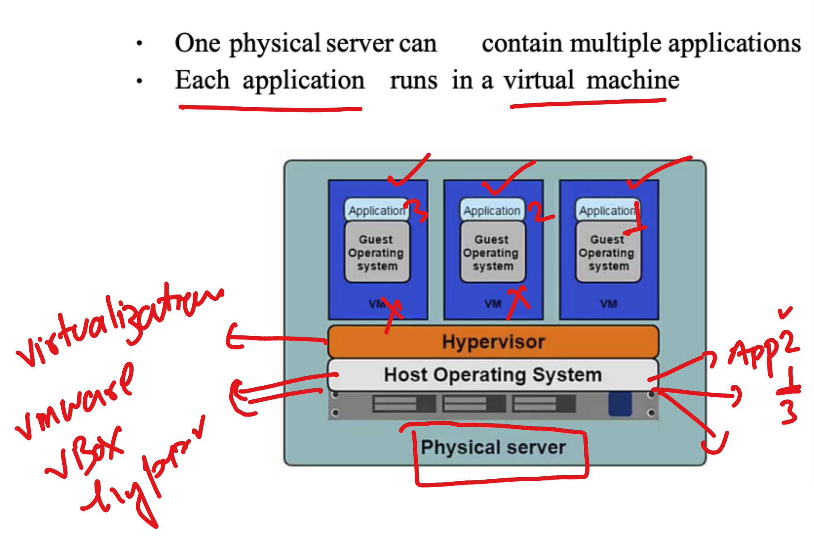
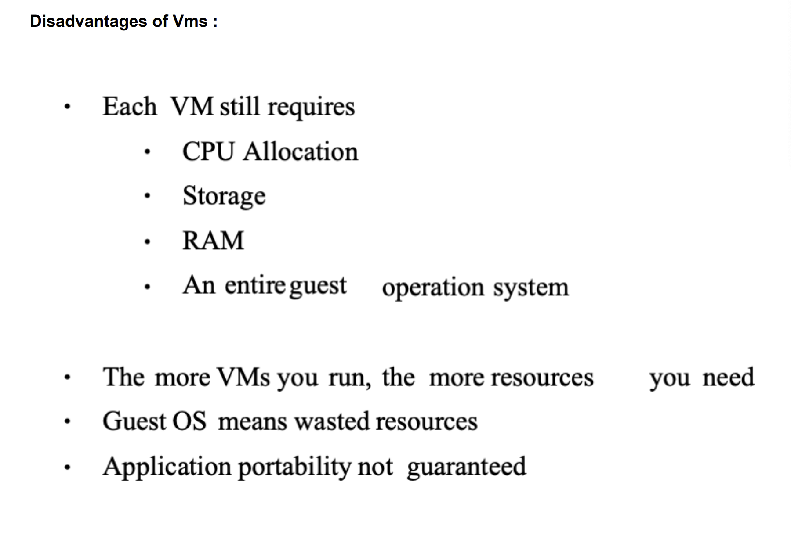
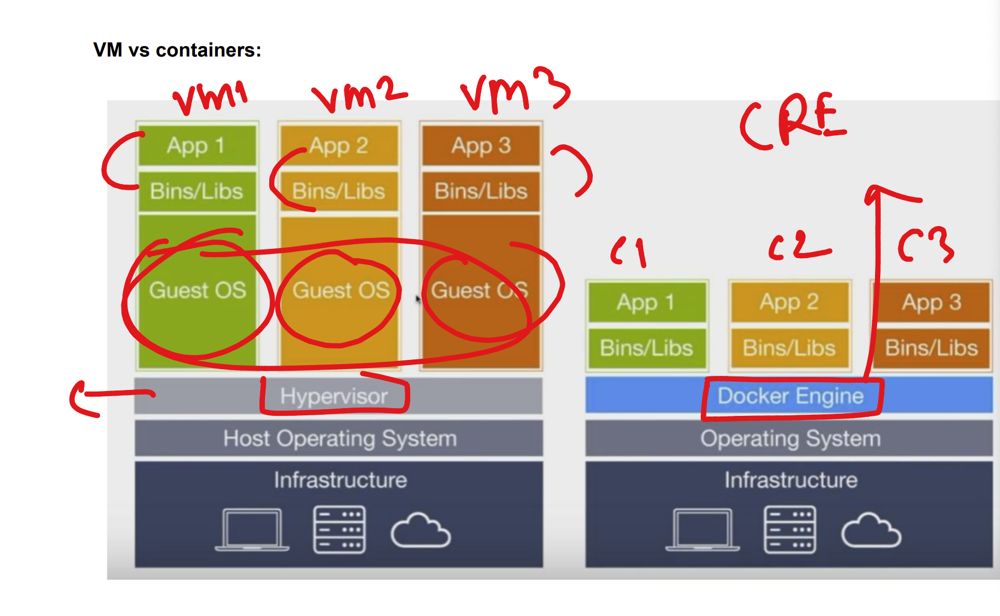
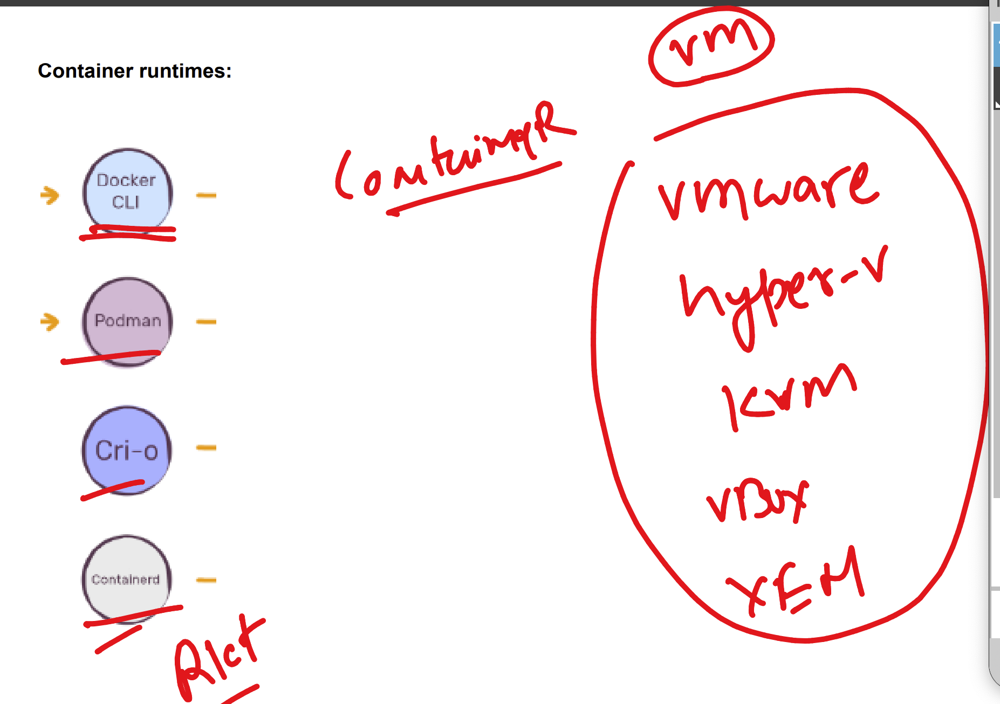
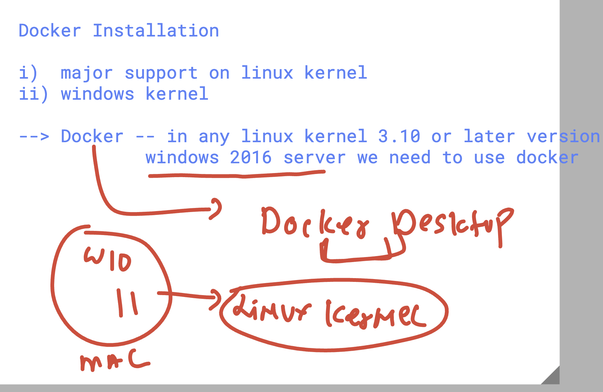
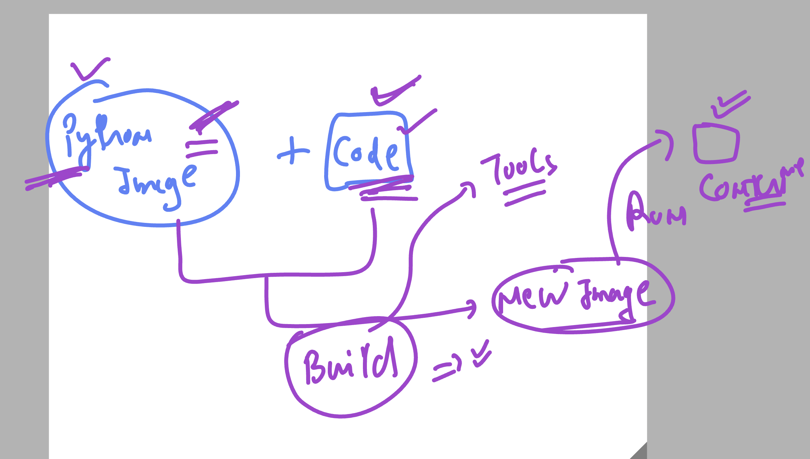

# DO-280-vodafone-15thDec_2025

### Virtual machine over physical machine 



### virtual machine controlling more resources than app 



## vm vs containers 



### Understanding container runtime engines 



## Docker installation 



## Installing docker 25 version in rhel 9 

```
dnf install docker 
Amazon Linux 2023 Kernel Livepatch repository                                                   264 kB/s |  29 kB     00:00    
Dependencies resolved.
================================================================================================================================
 Package                              Architecture         Version                              Repository                 Size
================================================================================================================================
Installing:
 docker                               x86_64               25.0.13-1.amzn2023.0.2               amazonlinux                46 M
Installing dependencies:


```
### starting docker 

```
systemctl enable --now docker
```

### verify docker status 

```
docker  version 
Client:
 Version:           25.0.13
 API version:       1.44
 Go version:        go1.24.9
 Git commit:        0bab007
 Built:             Mon Nov  3 00:00:00 2025
 OS/Arch:           linux/amd64
 Context:           default

Server:
 Engine:
  Version:          25.0.13
  API version:      1.44 (minimum version 1.24)
  Go version:       go1.24.9
  Git commit:       165516e
  Built:            Mon Nov  3 00:00:00 2025

```

### container images are bundle of libs  created by companies / orgs


### docker image pulling from docker hub / quay.io 

```
 3  docker  pull openjdk 
    4  docker  pull openjdk:11 
    5  docker pull  alpine 
    6  docker pull  nginx 
    7  docker pull  mysql:9.5
    8  history 
    9  docker images
   10  /Users/humanfirmware/Desktop/Tranings/JPMC/spark_k8s/Docker\ \ Training_PPT.pdf 
   11  docker pull quay.io/redhattraining/hello-world-nginx
   12  history 
[ashu@ip-172-31-35-119 ~]$ 
[ashu@ip-172-31-35-119 ~]$ docker images
REPOSITORY                                 TAG       IMAGE ID       CREATED       SIZE
nginx                                      latest    576306625d79   5 days ago    152MB
alpine                                     latest    7acffee03fe8   11 days ago   8.44MB
mysql                                      9.5       00f3a44f3de1   12 days ago   932MB
quay.io/redhattraining/hello-world-nginx   latest    69afa23e1e47   6 years ago   259MB

```
## building container images with custom source code



### creating directory structure 

```
mkdir   ashu-project
[ashu@ip-172-31-35-119 ~]$ ls
ashu-project
[ashu@ip-172-31-35-119 ~]$ mkdir   ashu-project/python-app
[ashu@ip-172-31-35-119 ~]$ mkdir   ashu-project/java-app
[ashu@ip-172-31-35-119 ~]$ mkdir   ashu-project/web-app
[ashu@ip-172-31-35-119 ~]$ tree ashu-project/
ashu-project/
├── java-app
├── python-app
└── web-app

```
### using files 

```
 cd ashu-project/python-app/
[ashu@ip-172-31-35-119 python-app]$ ls
[ashu@ip-172-31-35-119 python-app]$ touch  hello.py  Dockerfile 
[ashu@ip-172-31-35-119 python-app]$ 

```
