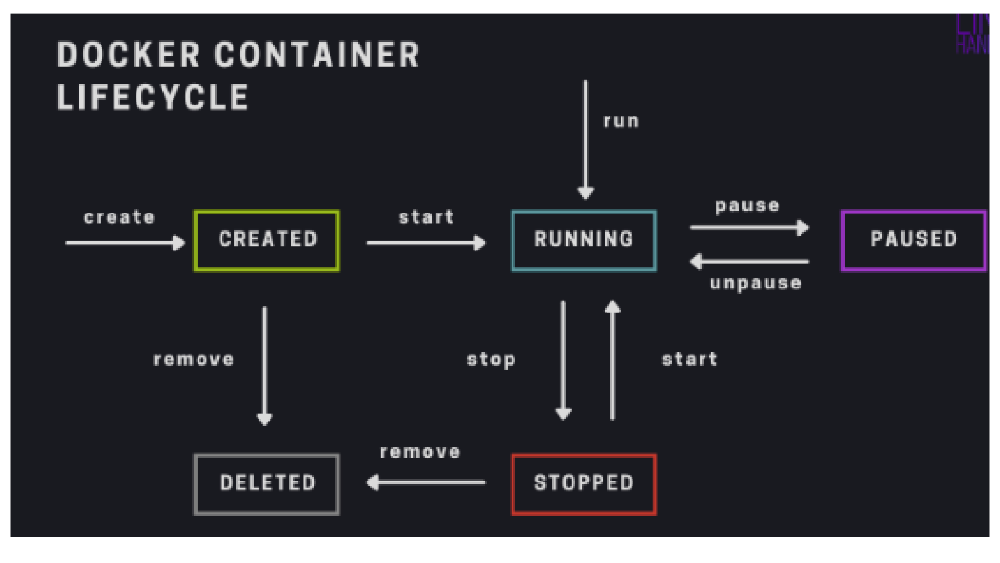
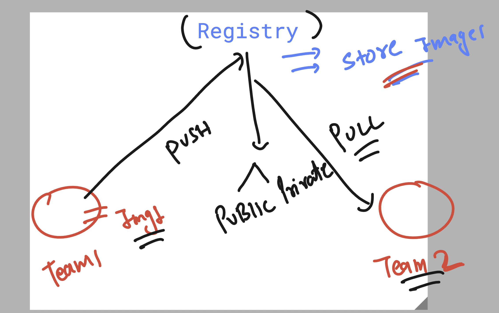
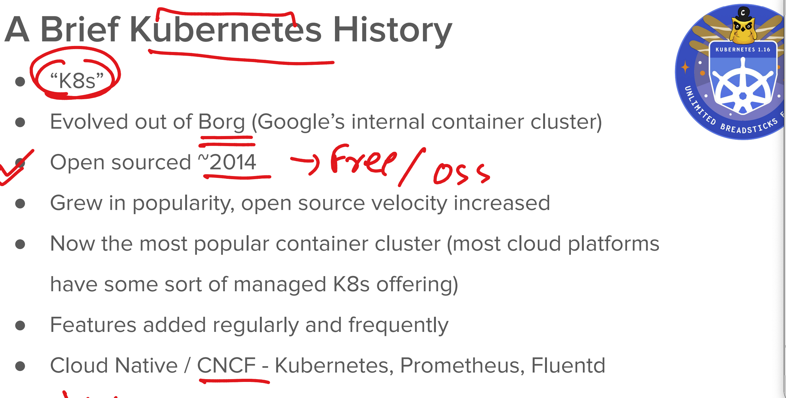
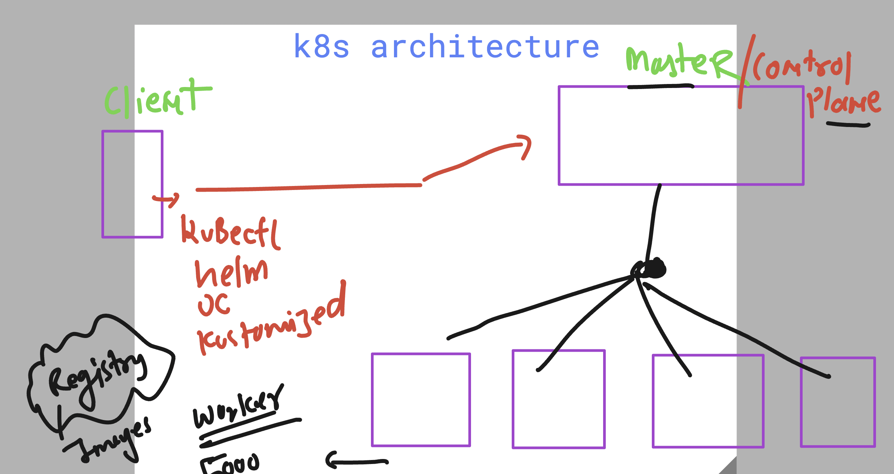
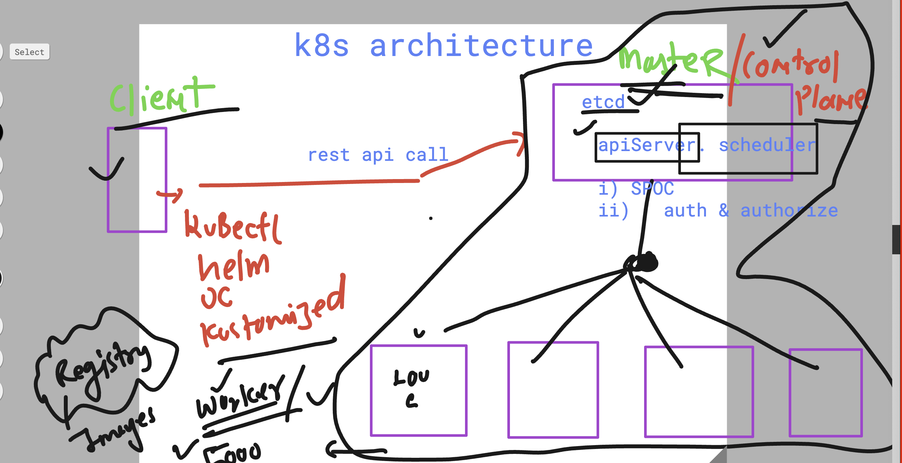
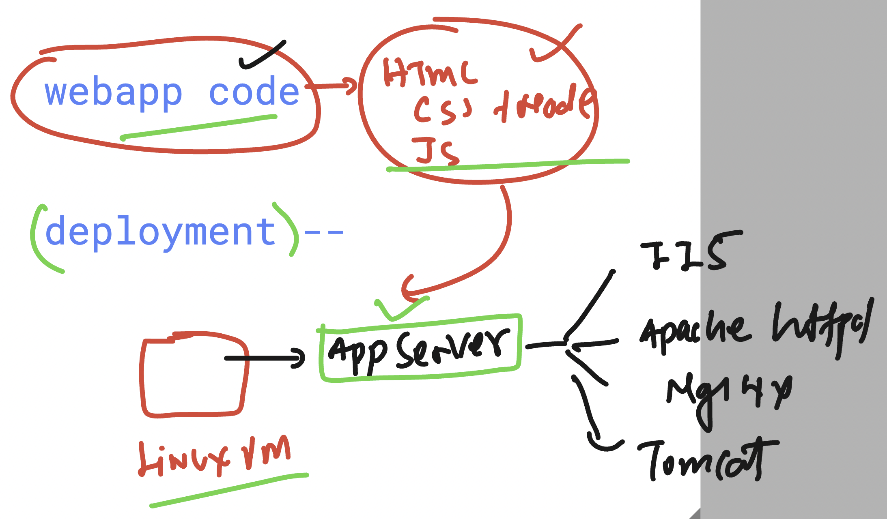
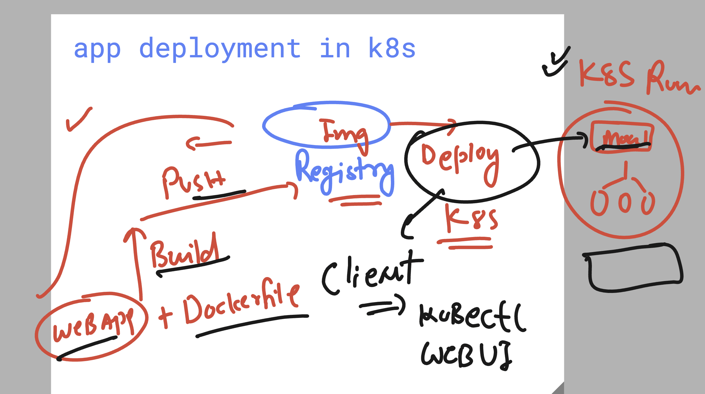
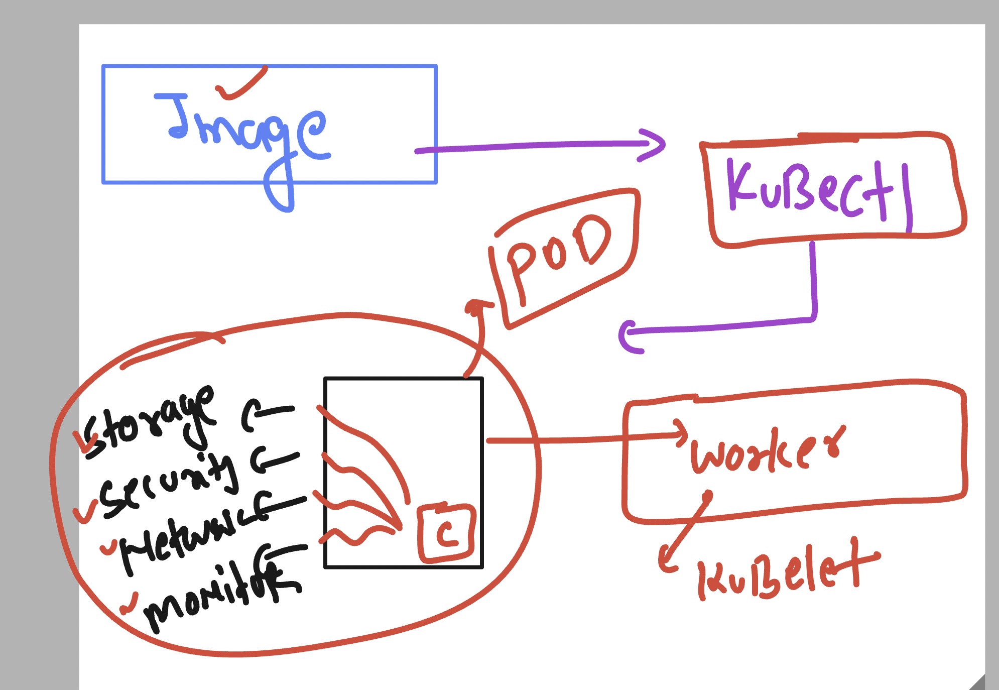

# DO-280-vodafone-15thDec_2025

## Virtual machine over physical machine 


## Virtual machine controlling more resources than app 


## VM vs Containers 


## Understanding container runtime engines 


## Docker installation 


## Installing docker 25 version in RHEL 9 

```bash
dnf install docker 
Amazon Linux 2023 Kernel Livepatch repository                                                   264 kB/s |  29 kB     00:00    
Dependencies resolved.
================================================================================================================================
 Package                              Architecture         Version                              Repository                 Size
================================================================================================================================
Installing:
 docker                               x86_64               25.0.13-1.amzn2023.0.2               amazonlinux                46 M
Installing dependencies:
```

## Starting docker 

```bash
systemctl enable --now docker
```

## Verify docker status 

```bash
docker version 
Client:
 Version:           25.0.13
 API version:       1.44
 Go version:        go1.24.9
 Git commit:        0bab007
 Built:             Mon Nov  3 00:00:00 2025
 OS/Arch:           linux/amd64
 Context:           default

Server:
 Engine:
   Version:          25.0.13
   API version:      1.44 (minimum version 1.24)
   Go version:       go1.24.9
   Git commit:       165516e
   Built:            Mon Nov  3 00:00:00 2025
```

## Container images are bundle of libs created by companies / orgs


## Docker image pulling from Docker Hub / Quay.io 

```bash
docker pull openjdk 
docker pull openjdk:11 
docker pull alpine 
docker pull nginx 
docker pull mysql:9.5
docker pull quay.io/redhattraining/hello-world-nginx

docker images
```

**Output:**
```
REPOSITORY                                 TAG       IMAGE ID       CREATED       SIZE
nginx                                      latest    576306625d79   5 days ago    152MB
alpine                                     latest    7acffee03fe8   11 days ago   8.44MB
mysql                                      9.5       00f3a44f3de1   12 days ago   932MB
quay.io/redhattraining/hello-world-nginx   latest    69afa23e1e47   6 years ago   259MB
```

## Building container images with custom source code


## Creating directory structure 

```bash
mkdir ashu-project
mkdir ashu-project/python-app
mkdir ashu-project/java-app
mkdir ashu-project/web-app
tree ashu-project/
```

**Output:**
```
ashu-project/
├── java-app
├── python-app
└── web-app
```

## Using files 

```bash
cd ashu-project/python-app/
touch hello.py Dockerfile 
```

## Building docker image

```bash
ls
# Dockerfile  hello.py

docker build -t ashupython:v1 .
```

**Output:**
```
[+] Building 0.8s (8/8) FINISHED                                                                              docker:default
 => [internal] load build definition from Dockerfile                                                                    0.0s
 => => transferring dockerfile: 378B                                                                                    0.0s
 => [internal] load metadata for docker.io/library/python:latest                                                        0.0s
 => [internal] load .dockerignore                                                                                       0.0s
 => => transferring context: 2B                                                                                         0.0s
 => [1/3] FROM docker.io/library/python:latest                                                                          0.1s
 => [internal] load build context                                                                                       0.0s
 => => transferring context: 328B                                                                                       0.0s
 => [2/3] RUN  mkdir  /ashuapp                                                                                          0.4s
 => [3/3] COPY hello.py /ashuapp/hello.py                                                                               0.0s
 => exporting to image                                                                                                  0.0s
 => => exporting layers                                                                                                 0.0s
 => => writing image sha256:e3e55384541180fa8d47240ce583e9edd5c5df7efb6eedfbfcbe74f379fa0548                            0.0s
 => => naming to docker.io/library/ashupython:v1                                                                        0.0s
```

```bash
docker images
```

**Output:**
```
REPOSITORY                                 TAG                 IMAGE ID       CREATED          SIZE
ashupython                                 v1                  e3e553845411   15 seconds ago   1.12GB
quay.io/fedora/httpd-24                    latest              e7b142b25d18   5 days ago       342MB
nginx                                      1.29.4-alpine3.23   a236f84b9d5d   5 days ago       53.7MB
```

## Creating container to test python app 

```bash
docker run -itd --name ashuc1 ashupython:v1 
# 1aa5faf4cf3aaeae57d0ba440ffdbd6402d0a37c276d56ba6c1629b8e0c31f08

docker ps
```

**Output:**
```
CONTAINER ID   IMAGE           COMMAND                  CREATED          STATUS          PORTS     NAMES
1aa5faf4cf3a   ashupython:v1   "python /ashuapp/hel…"   25 seconds ago   Up 24 seconds             ashuc1
```

### checking output of app running in container 

```
 51  docker logs ashuc1 
   52  docker logs -f  ashuc1 
```
### few more operations 

```
 55  docker stop ashuc1
   56  docker ps
   57  docker start ashuc1
   58  docker ps
   59  history 
[ashu@ip-172-31-35-119 python-app]$ docker stop ashuc1
ashuc1
[ashu@ip-172-31-35-119 python-app]$ docker rm ashuc1
ashuc1

```
### container life cycle 



### docker more operations 

```
docker  exec  -ti rajesh   /bin/bash 
root@5086bfa8ed66:/# 
root@5086bfa8ed66:/# 
root@5086bfa8ed66:/# ls
bin  boot  dev	etc  home  lib	lib64  media  mnt  opt	proc  rajeshapp  root  run  sbin  srv  sys  tmp  usr  var
root@5086bfa8ed66:/# exit
exit
[ashu@ip-172-31-35-119 python-app]$ docker inspect rajesh
[
    {
        "Id": "5086bfa8ed668363c65932e534c61b2797dc227b27e89faddf2a3513443b789f",
        "Created": "2025-12-15T07:33:19.704280743Z",
        "Path": "python",
        "Args": [
            "/rajeshapp/hello.py"
        ],
        "State": {
            "Status": "running",
            "Running": true,
            "Paused": false,
            "Restarting": false,
            "OOMKilled": false,

```

### container image registry 



## pushing image to docker hub 

```
[ashu@ip-172-31-35-119 python-app]$ 
[ashu@ip-172-31-35-119 python-app]$ docker tag  ashupython:v1  docker.io/dockerashu/vodafone-apps:versionv1
[ashu@ip-172-31-35-119 python-app]$ 
[ashu@ip-172-31-35-119 python-app]$ docker login -u dockerashu
Password: 
WARNING! Your password will be stored unencrypted in /home/ashu/.docker/config.json.
Configure a credential helper to remove this warning. See
https://docs.docker.com/engine/reference/commandline/login/#credentials-store

Login Succeeded
[ashu@ip-172-31-35-119 python-app]$ docker push  docker.io/dockerashu/vodafone-apps:versionv1
The push refers to repository [docker.io/dockerashu/vodafone-apps]
237d9863d9a5: Pushed 
959bdeab2ec7: Pushed 
99026168d02f: Mounted from rajeshravi5960/py 
5c1d27353faa: Mounted from rajeshravi5960/py 
f89b412f0854: Mounted from rajeshravi5960/py 
662b8975365c: Mounted from rajeshravi5960/py 
8e47c7b8acf3: Mounted from rajeshravi5960/py 
0b208bc29d30: Mounted from rajeshravi5960/py 
e9b010e49a06: Mounted from rajeshravi5960/py 
versionv1: digest: sha256:568a19c902e825d5a389faa60c5048b768450ad529c0abc3e8062e0b308b52a0 size: 2210

[ashu@ip-172-31-35-119 python-app]$ docker logout 
Removing login credentials for https://index.docker.io/v1/
[ashu@ip-172-31-35-119 python-app]$ 

```

## Understanding app deployment problems in container 


## Intro to k8s 



### k8s architecture 



### k8s more info 




### hint for task 

```
[ashu@ip-172-31-35-119 ~]$ ls
ashu-project
[ashu@ip-172-31-35-119 ~]$ cd ashu-project/
[ashu@ip-172-31-35-119 ashu-project]$ ls
java-app  python-app  web-app
[ashu@ip-172-31-35-119 ashu-project]$ cd web-app/
[ashu@ip-172-31-35-119 web-app]$ ls
[ashu@ip-172-31-35-119 web-app]$ git clone https://github.com/mdn/beginner-html-site-styled.git
Cloning into 'beginner-html-site-styled'...
remote: Enumerating objects: 54, done.
remote: Counting objects: 100% (2/2), done.
remote: Total 54 (delta 1), reused 1 (delta 1), pack-reused 52 (from 2)
Receiving objects: 100% (54/54), 128.76 KiB | 8.58 MiB/s, done.
Resolving deltas: 100% (14/14), done.
[ashu@ip-172-31-35-119 web-app]$ ls
beginner-html-site-styled
[ashu@ip-172-31-35-119 web-app]$ 


```

### understanding webapp deployment in general 



### lets build webapp container image 

```
 102  docker build -t docker.io/dockerashu/ashu-appvodafone:v1  . 
  103  docker login -u dockerashu
  104  docker push docker.io/dockerashu/ashu-appvodafone:v1
  105  history 
[ashu@ip-172-31-35-119 web-app]$ ls
Dockerfile  beginner-html-site-styled
[ashu@ip-172-31-35-119 web-app]$ cat Dockerfile 
FROM nginx
COPY beginner-html-site-styled /usr/share/nginx/html/

```

### building image to deploy in k8s 



### using kubectl -- trying to connect  k8s control plane 

```
 kubectl  version 
Client Version: v1.33.3
Kustomize Version: v5.6.0
Error from server (NotFound): the server could not find the requested resource
[ashu@ip-172-31-35-119 ~]$ kubectl  version  --kubeconfig /tmp/config 
Client Version: v1.33.3
Kustomize Version: v5.6.0
Server Version: v1.33.5
[ashu@ip-172-31-35-119 ~]$ 

```

### copy data (kube-server creds) to correct location 

```
[ashu@ip-172-31-35-119 ~]$ mkdir  ~/.kube/
mkdir: cannot create directory ‘/home/ashu/.kube/’: File exists
[ashu@ip-172-31-35-119 ~]$ 
[ashu@ip-172-31-35-119 ~]$ cp -v  /tmp/config  ~/.kube/
'/tmp/config' -> '/home/ashu/.kube/config'
[ashu@ip-172-31-35-119 ~]$ 
[ashu@ip-172-31-35-119 ~]$ 
[ashu@ip-172-31-35-119 ~]$ 
[ashu@ip-172-31-35-119 ~]$ 
[ashu@ip-172-31-35-119 ~]$ kubectl  version 
Client Version: v1.33.3
Kustomize Version: v5.6.0
Server Version: v1.33.5

```
### checking worker nodes

```
kubectl   get nodes
NAME                                STATUS   ROLES    AGE   VERSION
aks-agentpool-67758540-vmss000000   Ready    <none>   73m   v1.33.5
aks-agentpool-67758540-vmss000001   Ready    <none>   73m   v1.33.5

```

### introduction to k8s pod 



### options to create pods 


### creating first pod using kubectl cli 

```
[ashu@ip-172-31-35-119 ~]$ kubectl   get  pods
No resources found in default namespace.
[ashu@ip-172-31-35-119 ~]$ 
[ashu@ip-172-31-35-119 ~]$ 
[ashu@ip-172-31-35-119 ~]$ kubectl   run  ashupod1 --image docker.io/dockerashu/ashu-appvodafone:v1  --port 80 
pod/ashupod1 created
[ashu@ip-172-31-35-119 ~]$ kubectl   get  pods
NAME       READY   STATUS    RESTARTS   AGE
ashupod1   1/1     Running   0          5s
[ashu@ip-172-31-35-119 ~]$ 

```
