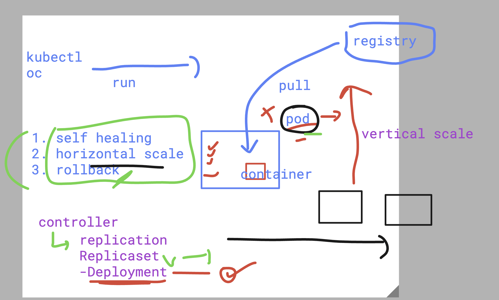
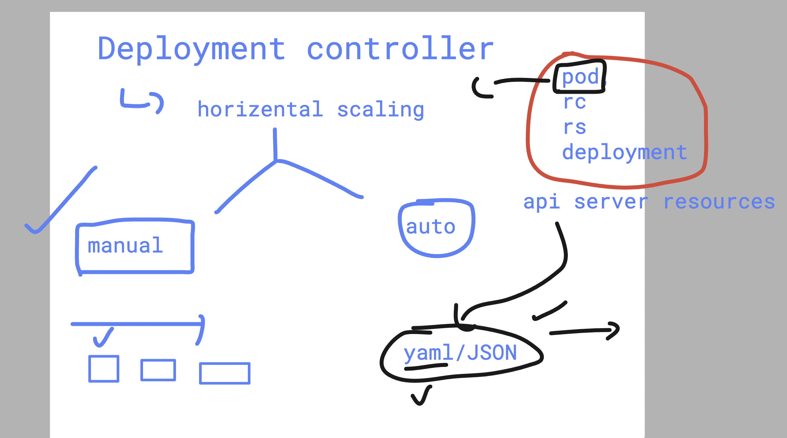
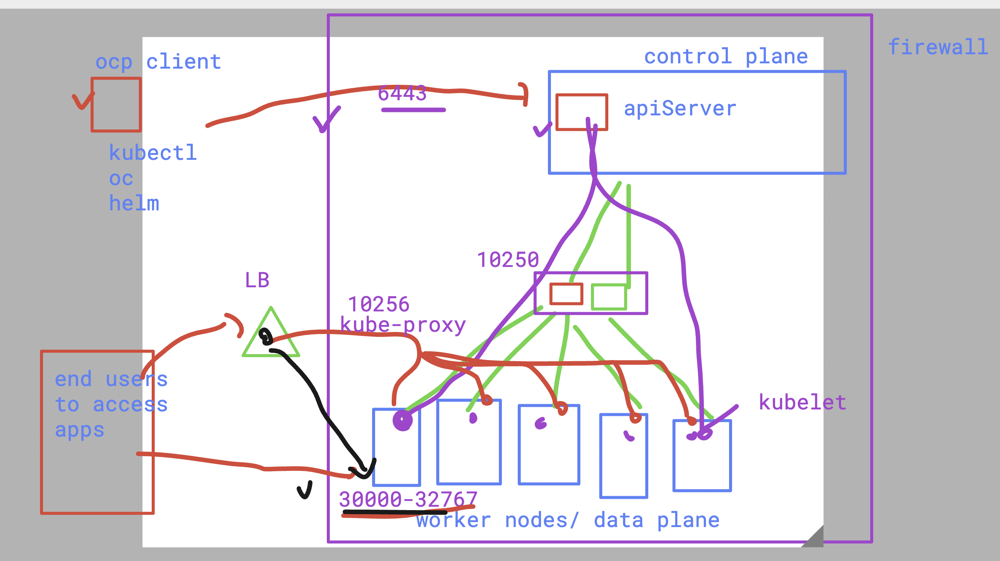
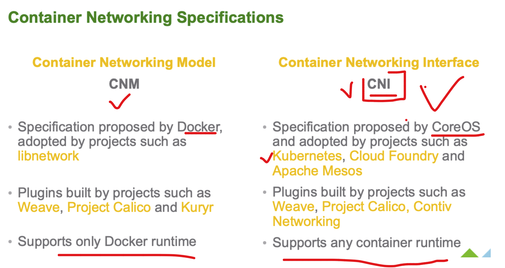
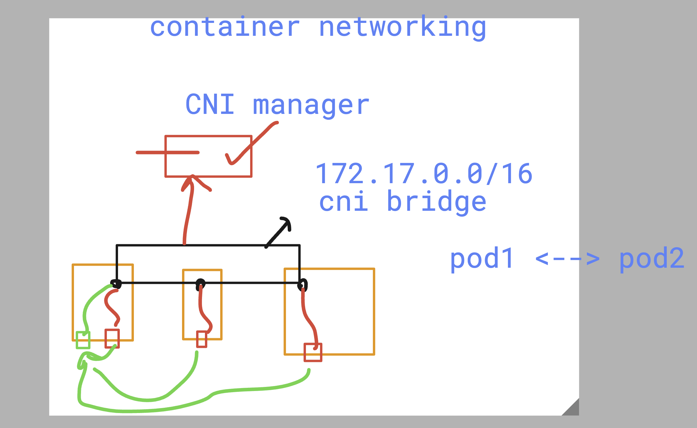

# DO-280-vodafone-15thDec_2025

## Checking docker thing

```bash
humanfirmware@darwin  ~  ssh  ashu@3.210.241.71
ashu@3.210.241.71's password: 
   ,     #_
   ~\_  ####_        Amazon Linux 2023
  ~~  \_#####\
  ~~     \###|
  ~~       \#/ ___   https://aws.amazon.com/linux/amazon-linux-2023
   ~~       V~' '->
    ~~~         /
      ~~._.   _/
         _/ _/
       _/m/'
[ashu@ip-172-31-17-7 ~]$ 
[ashu@ip-172-31-17-7 ~]$ docker  version 
Client:
 Version:           25.0.14
 API version:       1.44
 Go version:        go1.24.11
 Git commit:        0bab007
 Built:             Wed Dec 10 00:00:00 2025
 OS/Arch:           linux/amd64
 Context:           default
```

## Pulling all docker images we built

```bash
ashu@ip-172-31-17-7 ~]$ docker  images
REPOSITORY   TAG       IMAGE ID   CREATED   SIZE
[ashu@ip-172-31-17-7 ~]$ 
[ashu@ip-172-31-17-7 ~]$ 
[ashu@ip-172-31-17-7 ~]$ docker pull dockerashu/vodafone-apps:versionv1
versionv1: Pulling from dockerashu/vodafone-apps
80fc8f9321b5: Pull complete 
b22766554d6b: Pull complete 
58f2d358b447: Pull complete 
dd420cee8193: Pull complete 
388c30f2dc56: Pull complete 
5f3f8a41ae1e: Pull complete 
56d5b0133943: Pull complete 
9fc045489f9a: Pull complete 
a3f532665528: Pull complete 
Digest: sha256:568a19c902e825d5a389faa60c5048b768450ad529c0abc3e8062e0b308b52a0
Status: Downloaded newer image for dockerashu/vodafone-apps:versionv1
docker.io/dockerashu/vodafone-apps:versionv1
[ashu@ip-172-31-17-7 ~]$ 
[ashu@ip-172-31-17-7 ~]$ 
[ashu@ip-172-31-17-7 ~]$ docker images
REPOSITORY                 TAG         IMAGE ID       CREATED       SIZE
dockerashu/vodafone-apps   versionv1   e3e553845411   3 weeks ago   1.12GB
[ashu@ip-172-31-17-7 ~]$ 

docker pull dockerashu/ashu-appvodafone:v1
v1: Pulling from dockerashu/ashu-appvodafone
5ba766340b3d: Already exists 
5b219a92f92a: Already exists 
ee3a09d2248a: Already exists 
7382b41547b8: Already exists 
9ee60c6c0558: Already exists 
114e699da838: Already exists 
5b5fa0b64d74: Already exists 
862312bfff11: Pull complete 
Digest: sha256:a9ba4ac217dbafeb8e882bb131e78de3f40d670d5ff2509a57ec67e02a1e101d
Status: Downloaded newer image for dockerashu/ashu-appvodafone:v1
docker.io/dockerashu/ashu-appvodafone:v1
[ashu@ip-172-31-17-7 ~]$ docker images
REPOSITORY                       TAG         IMAGE ID       CREATED       SIZE
dershana/darshu-webappvodafone   version1    bbf02c912118   3 weeks ago   152MB
dockerashu/ashu-appvodafone      v1          a9913b5bf31f   3 weeks ago   152MB
dockerashu/vodafone-apps         versionv1   e3e553845411   3 weeks ago   1.12GB
```

## OCP architecture layer


## Building one container image with sample webapp code

```bash
mkdir   myapps
mkdir: cannot create directory 'myapps': File exists
[ashu@ip-172-31-17-7 ~]$ ls
myapps
[ashu@ip-172-31-17-7 ~]$ cd myapps/
[ashu@ip-172-31-17-7 myapps]$ git clone https://github.com/codingstella/vCard-personal-portfolio.git
Cloning into 'vCard-personal-portfolio'...
remote: Enumerating objects: 72, done.
remote: Counting objects: 100% (22/22), done.
remote: Compressing objects: 100% (18/18), done.
remote: Total 72 (delta 9), reused 4 (delta 4), pack-reused 50 (from 1)
Receiving objects: 100% (72/72), 1.13 MiB | 58.01 MiB/s, done.
Resolving deltas: 100% (9/9), done.
[ashu@ip-172-31-17-7 myapps]$ ls
vCard-personal-portfolio
[ashu@ip-172-31-17-7 myapps]$ 

21  cd vCard-personal-portfolio/
22  ls
23  ls -a
24  touch Dockerfile 
25  ls
26  touch  .dockerignore 
27  ls -a
28  history 
[ashu@ip-172-31-17-7 vCard-personal-portfolio]$ ls -a
.  ..  .dockerignore  .git  Dockerfile  README.md  assets  index.html  index.txt  website-demo-image
[ashu@ip-172-31-17-7 vCard-personal-portfolio]$ vim .dockerignore 
[ashu@ip-172-31-17-7 vCard-personal-portfolio]$ ls -a
.  ..  .dockerignore  .git  Dockerfile  README.md  assets  index.html  index.txt  website-demo-image
[ashu@ip-172-31-17-7 vCard-personal-portfolio]$ cat .dockerignore 
Dockerfile
.dockerignore
.git
README.md
index.txt
```

## Building container image

```bash
38  docker build -t  ashuapp:v0011 . 
39  history 
[ashu@ip-172-31-17-7 vCard-personal-portfolio]$ ls
Dockerfile  README.md  assets  index.html  index.txt  website-demo-image
[ashu@ip-172-31-17-7 vCard-personal-portfolio]$ docker images
REPOSITORY                       TAG         IMAGE ID       CREATED          SIZE
ashuapp                          v0011       942889ad2679   10 seconds ago   162MB
```

## App is running in container env

```bash
41  docker images
42  docker run -itd --name ashuc1  -p 1234:80 ashuapp:v0011
43  docker ps
```

## Stop container and remove

```bash
docker  rm ashuc1 -f
```

## Pushing image to docker hub

```bash
[ashu@ip-172-31-17-7 vCard-personal-portfolio]$ docker  tag  ashuapp:v0011  dockerashu/ashu-appvodafone:v2
[ashu@ip-172-31-17-7 vCard-personal-portfolio]$ docker login 
Log in with your Docker ID or email address to push and pull images from Docker Hub. If you don't have a Docker ID, head over to https://hub.docker.com/ to create one.
You can log in with your password or a Personal Access Token (PAT). Using a limited-scope PAT grants better security and is required for organizations using SSO. Learn more at https://docs.docker.com/go/access-tokens/

Username: dockerashu
Password: 
WARNING! Your password will be stored unencrypted in /home/ashu/.docker/config.json.
Configure a credential helper to remove this warning. See
https://docs.docker.com/engine/reference/commandline/login/#credentials-store

Login Succeeded
[ashu@ip-172-31-17-7 vCard-personal-portfolio]$ docker push dockerashu/ashu-appvodafone:v2
The push refers to repository [docker.io/dockerashu/ashu-appvodafone]
84d2754b6213: Pushed 
7bc3e3f1caf4: Mounted from library/nginx 
a91b21b8651d: Mounted from library/nginx 
f248169098dd: Mounted from library/nginx 
62bbe9e286ea: Mounted from library/nginx 
675cd787fdd9: Mounted from library/nginx 
22851f4f9a0b: Mounted from library/nginx 
6a7f953ae30c: Mounted from library/nginx 
v2: digest: sha256:ac262c567024007d15d828ef82b589ac106157e697a14a4437355ba65f8f8d58 size: 1989
[ashu@ip-172-31-17-7 vCard-personal-portfolio]$ 
```

## Connection OCP cluster using kubectl with auth

```bash
kubectl   get nodes  --kubeconfig   /opt/ocp/kubeconfig   
NAME                          STATUS   ROLES                  AGE     VERSION
ip-10-0-28-245.ec2.internal   Ready    worker                 3h13m   v1.29.5+29c95f3
ip-10-0-4-37.ec2.internal     Ready    control-plane,master   3h23m   v1.29.5+29c95f3
ip-10-0-55-78.ec2.internal    Ready    worker                 3h13m   v1.29.5+29c95f3
ip-10-0-59-36.ec2.internal    Ready    control-plane,master   3h23m   v1.29.5+29c95f3
ip-10-0-67-253.ec2.internal   Ready    control-plane,master   3h23m   v1.29.5+29c95f3
ip-10-0-68-70.ec2.internal    Ready    worker                 3h13m   v1.29.5+29c95f3
```

## Copy auth file to default location with default name

```bash
[ashu@openshift ~]$ mkdir  ~/.kube/
mkdir: cannot create directory '/home/ashu/.kube/': File exists
[ashu@openshift ~]$ 
[ashu@openshift ~]$ cp -v /opt/ocp/kubeconfig   ~/.kube/config 
'/opt/ocp/kubeconfig' -> '/home/ashu/.kube/config'
[ashu@openshift ~]$ 
[ashu@openshift ~]$ 
[ashu@openshift ~]$ kubectl   version 
Client Version: v1.29.1
Kustomize Version: v5.0.4-0.20230601165947-6ce0bf390ce3
Server Version: v1.29.5+29c95f3
[ashu@openshift ~]$ kubectl   get nodes
NAME                          STATUS   ROLES                  AGE     VERSION
ip-10-0-28-245.ec2.internal   Ready    worker                 3h15m   v1.29.5+29c95f3
ip-10-0-4-37.ec2.internal     Ready    control-plane,master   3h25m   v1.29.5+29c95f3
ip-10-0-55-78.ec2.internal    Ready    worker                 3h15m   v1.29.5+29c95f3
ip-10-0-59-36.ec2.internal    Ready    control-plane,master   3h24m   v1.29.5+29c95f3
ip-10-0-67-253.ec2.internal   Ready    control-plane,master   3h25m   v1.29.5+29c95f3
ip-10-0-68-70.ec2.internal    Ready    worker                 3h15m   v1.29.5+29c95f3
```
### creating first ever pod to ocp cluster from client machine 

```
[ashu@openshift ~]$ kubectl  get  pods
No resources found in default namespace.
[ashu@openshift ~]$ 
[ashu@openshift ~]$ kubectl  run  ashupod1  --image  docker.io/dockerashu/ashu-appvodafone:v1  --port 80 
pod/ashupod1 created
[ashu@openshift ~]$ 
[ashu@openshift ~]$ kubectl   get  pods
NAME       READY   STATUS    RESTARTS   AGE
ashupod1   1/1     Running   0          9s


```

### deleting pod 

```
kubectl delete pod rohitpod2 t1 nileshpod2  nileshpod1
pod "rohitpod2" deleted
pod "t1" deleted
pod "nileshpod2" deleted
pod "nileshpod1" deleted

```
### to create pod we gonna use controllers 



### creating pod using deployment controller

```
kubectl  create  deployment   ashu-app-deploy  --image docker.io/dockerashu/ashu-appvodafone:v1 --port 80 
deployment.apps/ashu-app-deploy created
[ashu@openshift ~]$ kubectl get deployment 
NAME              READY   UP-TO-DATE   AVAILABLE   AGE
ashu-app-deploy   1/1     1            1           12s
[ashu@openshift ~]$ 
[ashu@openshift ~]$ 
[ashu@openshift ~]$ kubectl   get  pods
NAME                               READY   STATUS    RESTARTS   AGE
ashu-app-deploy-6648ff475f-5nhxn   1/1     Running   0          27s
[ashu@openshift ~]$ 
[ashu@openshift ~]$ 
[ashu@openshift ~]$ 
[ashu@openshift ~]$ kubectl delete pod ashu-app-deploy-6648ff475f-5nhxn
pod "ashu-app-deploy-6648ff475f-5nhxn" deleted
[ashu@openshift ~]$ kubectl   get  pods
NAME                               READY   STATUS    RESTARTS   AGE
ashu-app-deploy-6648ff475f-7z2r7   1/1     Running   0          3s
[ashu@openshift ~]$ 

```

### originally all ocp resources are getting converted into YAML/JSON file format



### checking apiVersion for all ocp resources

```
shu@openshift ~]$ kubectl  api-resources 
NAME                                  SHORTNAMES                                                                             APIVERSION                                    NAMESPACED   KIND
bindings                                                                                                                     v1                                            true         Binding
componentstatuses                     cs                                                                                     v1                                            false        ComponentStatus
configmaps                            cm                                                                                     v1                                            true         ConfigMap
endpoints                             ep                                                                                     v1                                            true         Endpoints
events                                ev                                                                                     v1                                            true         Event
limitranges                           limits                                                                                 v1                                            true         LimitRange
namespaces                            ns                                                                                     v1                                            false        Namespace
nodes                                 no                                                                                     v1                                            false        Node
persistentvolumeclaims                pvc                                                                                    v1                                            true         PersistentVolumeClaim
persistentvolumes                     pv                                                                                     v1                                            false        PersistentVolume
pods                                  po                                                                                     v1                                            true         Pod
podtemplates                                                                                                                 v1                                            true         PodTemplate
replicationcontrollers                rc                                                                                     v1                                            true         ReplicationController
resourcequotas                        quota                                                                                  v1                                            true         ResourceQuota
secrets                                                                                                                      v1                                            true         Secret
serviceaccounts                       sa                                                                                     v1                                            true         ServiceAccount
services                              svc                                                                                    v1                                            true         Service

```
### history of some useful oc/kubectl options 

```
38  kubectl  run  ashupod1  --image  docker.io/dockerashu/ashu-appvodafone:v1  --port 80  --dry-run=client 
   39  kubectl  get  pods
   40  kubectl  run  ashupod1  --image  docker.io/dockerashu/ashu-appvodafone:v1  --port 80 --dry-run=client -o yaml 
   41  history 
   42  kubectl  create  deployment   ashu-app-deploy  --image docker.io/dockerashu/ashu-appvodafone:v1 --port 80 --dry-run=client
   43  kubectl  get deploy
   44  kubectl  create  deployment   ashu-app-deploy  --image docker.io/dockerashu/ashu-appvodafone:v1 --port 80 --dry-run=client  -o yaml 
   45  history 
   46  kubectl  create  deployment   ashu-app-deploy  --image docker.io/dockerashu/ashu-appvodafone:v1 --port 80 --dry-run=client  -o yaml   >ashudeploy1.yaml
   47  ls

```

### create deployment using yaml file 

```
[ashu@openshift ~]$ kubectl   create  -f  ashudeploy1.yaml 
deployment.apps/ashu-app-deploy created
[ashu@openshift ~]$ kubectl  get deployment 
NAME              READY   UP-TO-DATE   AVAILABLE   AGE
ashu-app-deploy   1/1     1            1           4s

```

### using kubectl apply / oc apply 

```
[ashu@openshift ~]$ kubectl apply   -f  ashudeploy1.yaml 
Warning: resource deployments/ashu-app-deploy is missing the kubectl.kubernetes.io/last-applied-configuration annotation which is required by kubectl apply. kubectl apply should only be used on resources created declaratively by either kubectl create --save-config or kubectl apply. The missing annotation will be patched automatically.
deployment.apps/ashu-app-deploy configured
[ashu@openshift ~]$ 
[ashu@openshift ~]$ kubectl  get  deploy 
NAME                    READY   UP-TO-DATE   AVAILABLE   AGE
ashu-app-deploy         2/2     2            2           9m48s
ayan-app-deploy         1/1     1            1           9m21s
bik-app-deploy          1/1     1            1           9m37s
darsh-app-deploy        1/1     1            1           9m3s
jaya-app-deploy         1/1     1            1           8m36s
kira-app-deploy         1/1     1            1           9m14s
nilesh-vodaapp-deploy   1/1     1            1           8m49s
rajeshdep1              1/1     1            1           9m9s
rohit-app-deploy        1/1     1            1           114s
vishal1-deployment      1/1     1            1           9m21s
[ashu@openshift ~]$ kubectl  get pods
NAME                                     READY   STATUS    RESTARTS   AGE
ashu-app-deploy-6648ff475f-2lvb6         1/1     Running   0          9m55s
ashu-app-deploy-6648ff475f-lvxt6         1/1     Running   0          25s


```

### scaling using cli 

```
66  kubectl   scale  deployment  ashu-app-deploy  --replicas=1
   67  kubectl  get deploy 
   68  kubectl   scale  deployment  ashu-app-deploy  --replicas=5
   69  kubectl  get deploy 
   70  kubectl  get pods
   71  kubectl   scale  deployment  ashu-app-deploy  --replicas=1

```

### checking with node level networking and firewall ports 




## Containet networking by CNI 



### CNI bridge will assing iP address to pods and they can communicate to each other



### checking pod ip 

```
## method 1

[ashu@openshift ~]$ kubectl  describe  pod  ashu-app-deploy-6648ff475f-jrbk8  
Name:             ashu-app-deploy-6648ff475f-jrbk8
Namespace:        default
Priority:         0
Service Account:  default
Node:             ip-10-0-55-78.ec2.internal/10.0.55.78
Start Time:       Mon, 12 Jan 2026 09:40:34 +0000
Labels:           app=ashu-app-deploy
                  pod-template-hash=6648ff475f
Annotations:      k8s.ovn.org/pod-networks:
                    {"default":{"ip_addresses":["10.131.0.36/23"],"mac_address":"0a:58:0a:83:00:24","gateway_ips":["10.131.0.1"],"routes":[{"dest":"10.128.0.0...
                  k8s.v1.cni.cncf.io/network-status:
                    [{
                        "name": "ovn-kubernetes",
                        "interface": "eth0",
                        "ips": [
                            "10.131.0.36"
                        ],
                        "mac": "0a:58:0a:83:00:24",
                        "default": true,
                        "dns": {}
                    }]
Status:           Running
IP:               10.131.0.36
IPs:
  IP:           10.131.0.36
Controlled By:  ReplicaSet/ashu-app-deploy-6648ff475f
Containers:
  ashu-appvodafone:


### method 2 

kubectl   get  pods ashu-app-deploy-6648ff475f-jrbk8  -o wide 
NAME                               READY   STATUS    RESTARTS   AGE   IP            NODE                         NOMINATED NODE   READINESS GATES
ashu-app-deploy-6648ff475f-jrbk8   1/1     Running   0          45m   10.131.0.36   ip

```

### pod to pod communication testing 

```
 kubectl   exec -it  ashu-connect -- /bin/sh 
/ # 
/ # 
/ # ping  10.131.0.36
PING 10.131.0.36 (10.131.0.36): 56 data bytes
64 bytes from 10.131.0.36: seq=0 ttl=42 time=2.739 ms
64 bytes from 10.131.0.36: seq=1 ttl=42 time=2.761 ms
^C
--- 10.131.0.36 ping statistics ---
2 packets transmitted, 2 packets received, 0% packet loss
round-trip min/avg/max = 2.739/2.750/2.761 ms
/ # ping  10.131.0.31
PING 10.131.0.31 (10.131.0.31): 56 data bytes
64 bytes from 10.131.0.31: seq=0 ttl=42 time=3.404 ms
64 bytes from 10.131.0.31: seq=1 ttl=42 time=1.556 ms
^C
--- 10.131.0.31 ping statistics ---
2 packets transmitted, 2 packets received, 0% packet loss
round-trip min/avg/max = 1.556/2.480/3.404 ms
/ # exit

```
