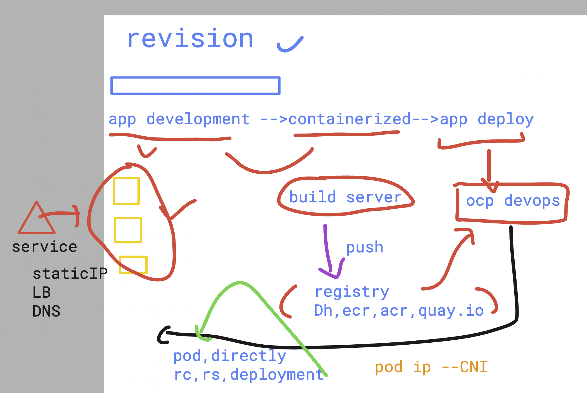
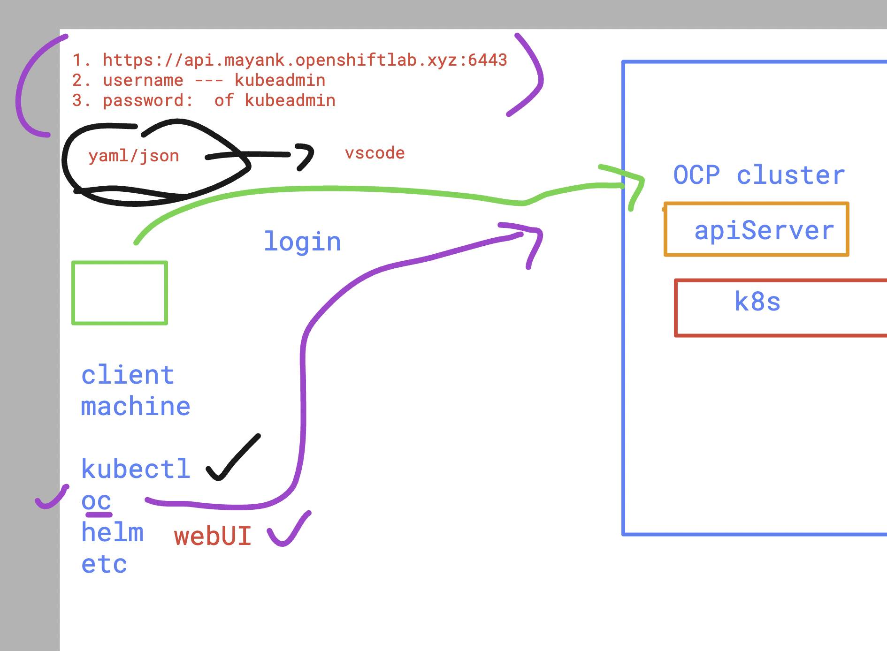
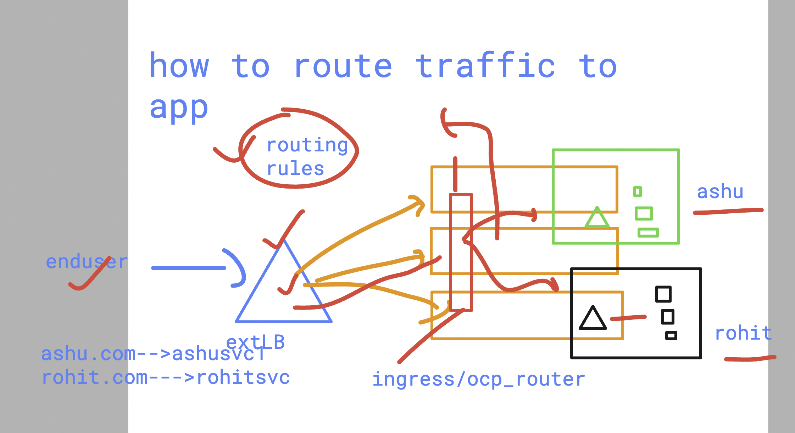
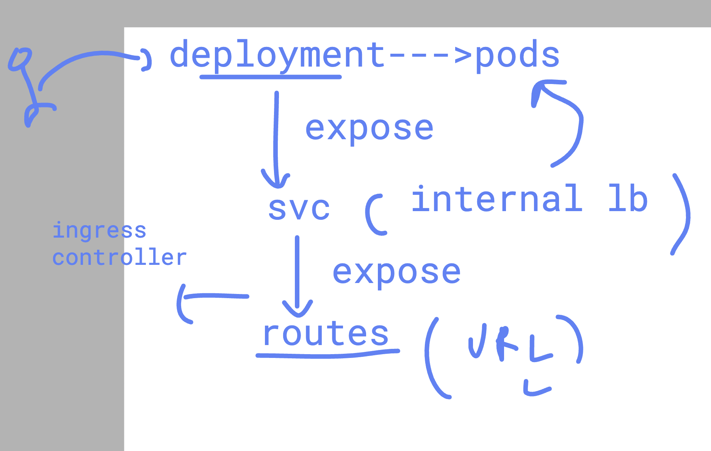

# DO-280-vodafone-15thDec_2025

### Revision 



### login to openshift cluster using oc cli 

```
oc login  https://api.mayank.openshiftlab.xyz:6443 -u kubeadmin 
WARNING: Using insecure TLS client config. Setting this option is not supported!

Console URL: https://api.mayank.openshiftlab.xyz:6443/console
Authentication required for https://api.mayank.openshiftlab.xyz:6443 (openshift)
Username: kubeadmin
Password: 
Login successful.

You have access to 70 projects, the list has been suppressed. You can list all projects with 'oc projects'

Using project "internal-reg-demo".

```

### login to ocp cluster options 



### listing all the projects 

```
 oc projects 
You have access to the following projects and can switch between them with ' project <projectname>':

    default
  * internal-reg-demo
    kube-node-lease
    kube-public
    kube-system
    openshift
    openshift-apiserver
    openshift-apiserver-operator
    openshift-authentication

```
### more project related things 

```
oc project
Using project "internal-reg-demo" on server "https://api.mayank.openshiftlab.xyz:6443".
[ec2-user@openshift ashu-manifestfiles]$ 
[ec2-user@openshift ashu-manifestfiles]$ 
[ec2-user@openshift ashu-manifestfiles]$ oc project  default 
Now using project "default" on server "https://api.mayank.openshiftlab.xyz:6443".
[ec2-user@openshift ashu-manifestfiles]$ 
[ec2-user@openshift ashu-manifestfiles]$ 
[ec2-user@openshift ashu-manifestfiles]$ 

```

### creating yaml 

```
 oc create deployment  ashu-deploy1  --image dockerashu/ashu-appvodafone:v2  --port 80 --dry-run=client  -o yaml >ashu-deploy.yaml 
```

### creating svc

```
oc create  -f  ashu-deploy.yaml 
deployment.apps/ashu-deploy1 created
[ec2-user@openshift ashu-manifestfiles]$ oc get deploy
NAME                READY   UP-TO-DATE   AVAILABLE   AGE
ashu-deploy1        1/1     1            1           4s
nilesh-app-deploy   1/1     1            1           3m8s
[ec2-user@openshift ashu-manifestfiles]$ oc expose deployment ashu-deploy1 --type ClusterIP --port 1234 --target-port 80 --dry-run=client -o yaml >ashusvc.yaml 
[ec2-user@openshift ashu-manifestfiles]$ ls
ashu-deploy.yaml  ashusvc.yaml
[ec2-user@openshift ashu-manifestfiles]$ oc create -f ashusvc.yaml 
service/ashu-deploy1 created
[ec2-user@openshift ashu-manifestfiles]$ oc get svc
NAME           TYPE           CLUSTER-IP     EXTERNAL-IP                            PORT(S)    AGE
ashu-deploy1   ClusterIP      172.30.82.94   <none>                                 1234/TCP   4s
kubernetes     ClusterIP      172.30.0.1     <none>                                 443/TCP    7m43s
openshift      ExternalName   <none>         kubernetes.default.svc.cluster.local   <none>     6m59s
[ec2-user@openshift ashu-manifestfiles]$ 
```

### creating nodeport service 

```
oc  expose deployment ashu-deploy1  --type NodePort --port 1234 --target-port 80 --name ashulb3 --dry-run=client -o yaml >ashunodeportsvc.yaml 
[ec2-user@openshift ashu-manifestfiles]$ oc create -f ashunodeportsvc.yaml 
service/ashulb3 created
[ec2-user@openshift ashu-manifestfiles]$ oc get svc
NAME               TYPE           CLUSTER-IP       EXTERNAL-IP                            PORT(S)          AGE
ashu-deploy1       ClusterIP      172.30.82.94     <none>                                 1234/TCP         19m
ashulb3            NodePort       172.30.53.52     <none>                                 1234:31367/TCP   3s

```

## checking openshift Ingress controller (openshift router)

```
oc get pods -n openshift-ingress
NAME                             READY   STATUS    RESTARTS   AGE
router-default-d97f4f994-94p6l   1/1     Running   1          27h
router-default-d97f4f994-zpg6b   1/1     Running   1          27h
[ec2-user@openshift ~]$ 
[ec2-user@openshift ~]$ 
[ec2-user@openshift ~]$ oc get deploy  -n openshift-ingress
NAME             READY   UP-TO-DATE   AVAILABLE   AGE
router-default   2/2     2            2           27h
[ec2-user@openshift ~]$ oc get svc  -n openshift-ingress
NAME                      TYPE           CLUSTER-IP       EXTERNAL-IP                                                               PORT(S)                      AGE
router-default            LoadBalancer   172.30.229.136   aae8d8f17b1ed4e978fbe909da8c7407-1826622764.us-east-1.elb.amazonaws.com   80:32117/TCP,443:32622/TCP   27h
router-internal-default   ClusterIP      172.30.253.66    <none>                                                                    80/TCP,443/TCP,1936/TCP      27h

```

### openshift routing rules 



### creating route 

```
oc create route  edge ashu-app-route --service ashu-deploy1  --port 1234
```

### deleting svc and routes 

```
 oc  delete  svc ashu-deploy1
 oc delete route ashu-deploy1

```

### exposing deployment to create svc

```
oc  expose  deployment ashu-deploy1  --type ClusterIP --port 1234 --target-port 80 --name ashu-websvc

service/ashu-websvc exposed
[ec2-user@openshift ~]$ oc get svc
NAME            TYPE           CLUSTER-IP      EXTERNAL-IP                            PORT(S)    AGE
ashu-websvc     ClusterIP      172.30.65.195   <none>                                 1234/TCP   19s
kiran-deploy2   ClusterIP      172.30.38.240   <none>                                 1234/TCP   163m
kubernetes      ClusterIP      172.30.0.1      <none>                                 443/TCP    3h3m
openshift       ExternalName   <none>          kubernetes.default.svc.cluster.local   <none>     3h2m
[ec2-user@openshift ~]$ oc  get  ep 
NAME            ENDPOINTS                                         AGE
ashu-websvc     10.131.0.17:80                                    27s

```

### expose svc to create route

```
oc expose svc ashu-websvc 

route/ashu-websvc exposed
[ec2-user@openshift ~]$ oc get  routes
NAME          HOST/PORT                                          PATH   SERVICES      PORT   TERMINATION   WILDCARD
ashu-websvc   ashu-websvc-default.apps.mayank.openshiftlab.xyz          ashu-websvc   80                   None
[ec2-user@openshift ~]$ 

```

### we are creating api resources to get final access



### building docker image locally to ocp 

```
oc  new-build  --binary --strategy=docker  --name=ashu-webapp  --to=ashu-app:v1 
    * A Docker build using binary input will be created
      * The resulting image will be pushed to image stream tag "ashu-app:v1"
      * A binary build was created, use 'oc start-build --from-dir' to trigger a new build

--> Creating resources with label build=ashu-webapp ...
    imagestream.image.openshift.io "ashu-app" created
    buildconfig.build.openshift.io "ashu-webapp" created
--> Success
[ec2-user@openshift ashu-webapp]$ oc get  is
NAME            IMAGE REPOSITORY                                                         TAGS   UPDATED
ashu-app        image-registry.openshift-image-registry.svc:5000/default/ashu-app               
bikram-apache   image-registry.openshift-image-registry.svc:5000/default/bikram-apache          
facebook-app    image-registry.openshift-image-registry.svc:5000/default/facebook-app           
[ec2-user@openshift ashu-webapp]$ oc  get  bc 
NAME            TYPE     FROM     LATEST
ashu-webapp     Docker   Binary   0
ayan-webapp     Docker   Binary   0
bikram-apache   Docker   Binary   0

```

### start building process

```
oc start-build ashu-webapp --from-dir=. --follow 
Uploading directory "." as binary input for the build ...

Uploading finished
build.build.openshift.io/ashu-webapp-1 started
Receiving source from STDIN as archive ...
time="2026-01-13T09:40:16Z" level=info msg="Not using native diff for overlay, this may cause degraded performance for building images: kernel has CONFIG_OVERLAY_FS_REDIRECT_DIR enabled"
I0113 09:40:16.226433       1 defaults.go:112] Defaulting to storage driver "overlay" with options [mountopt=metacopy=on].
Caching blobs under "/var/cache/blobs".

Pulling image nginx ...
Resolving "nginx" using unqualified-search registries (/etc/containers/registries.conf)
Trying to pull registry.redhat.io/nginx:latest...
Trying to pull registry.access.redhat.com/nginx:latest...

```
## creating deployment using internal ocp image 

```
oc  create  deployment  ashu-local-app --image image-registry.openshift-image-registry.svc:5000/default/ashu-app:v1 --port 80 --dry-run=client  -o yaml  >app-deploy1/deploy.yaml 

[ec2-user@openshift ashu-manifestfiles]$ 
[ec2-user@openshift ashu-manifestfiles]$ oc  create -f app-deploy1/deploy.yaml 
deployment.apps/ashu-local-app created


[ec2-user@openshift ashu-manifestfiles]$ oc  get  deployment 
NAME             READY   UP-TO-DATE   AVAILABLE   AGE
ashu-local-app   0/1     1            0           5s

```

### creating svc as internal LB to reach app pods 

```
oc expose deploy ashu-local-app  --type ClusterIP --port 3344 --target-port 80  --name ashusvc9 --dry-run=client -o yaml   >app-deploy1/svc.yaml 
[ec2-user@openshift ashu-manifestfiles]$ oc  create -f  app-deploy1/svc.yaml 
service/ashusvc9 created
[ec2-user@openshift ashu-manifestfiles]$ oc get svc
NAME         TYPE           CLUSTER-IP      EXTERNAL-IP                            PORT(S)    AGE
ashusvc9     ClusterIP      172.30.61.132   <none>                                 3344/TCP   3s

```

### creating routes by exposing svc 

```
oc expose svc ashusvc9
route/ashusvc9 exposed
[ec2-user@openshift ~]$ 
[ec2-user@openshift ~]$ oc get routes
NAME       HOST/PORT                                       PATH   SERVICES   PORT   TERMINATION   WILDCARD
ashusvc9   ashusvc9-default.apps.mayank.openshiftlab.xyz          ashusvc9   80                   None
[ec2-user@openshift ~]$ 


```
