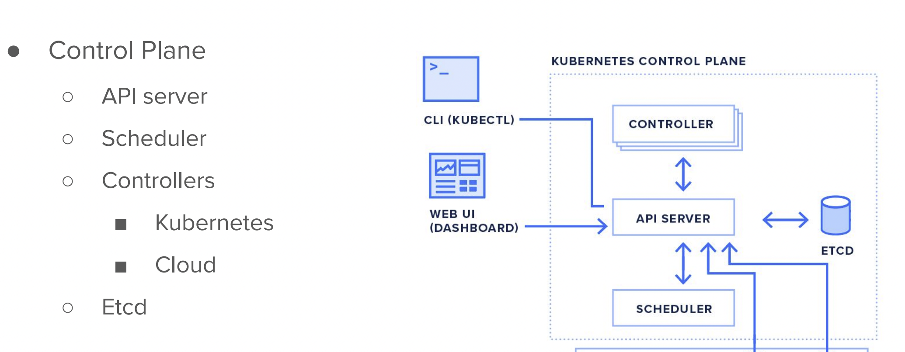

# DO-280-vodafone-15thDec_2025

### version check with arch discussion 

```
[ec2-user@openshift ~]$ oc get nodes
NAME                          STATUS   ROLES                  AGE    VERSION
ip-10-0-28-245.ec2.internal   Ready    worker                 2d1h   v1.29.5+29c95f3
ip-10-0-4-37.ec2.internal     Ready    control-plane,master   2d1h   v1.29.5+29c95f3
ip-10-0-55-78.ec2.internal    Ready    worker                 2d1h   v1.29.5+29c95f3
ip-10-0-59-36.ec2.internal    Ready    control-plane,master   2d1h   v1.29.5+29c95f3
ip-10-0-67-253.ec2.internal   Ready    control-plane,master   2d1h   v1.29.5+29c95f3
ip-10-0-68-70.ec2.internal    Ready    worker                 2d1h   v1.29.5+29c95f3
[ec2-user@openshift ~]$ oc version 
Client Version: 4.16.0
Kustomize Version: v5.0.4-0.20230601165947-6ce0bf390ce3
Server Version: 4.16.0
Kubernetes Version: v1.29.5+29c95f3
[ec2-user@openshift ~]$ kubectl  version 
Client Version: v1.29.1
Kustomize Version: v5.0.4-0.20230601165947-6ce0bf390ce3
Server Version: v1.29.5+29c95f3
[ec2-user@openshift ~]$ 

```
### master node components 



### check ocp internal pods 

```
345  oc get pods -A   | grep -i etcd
  346  oc get pods -A   | grep -i sche
  347  oc get pods -A   | grep -i apiser
```

### secret in ocp 

```
oc create  secret 
Create a secret with specified type.

 A docker-registry type secret is for accessing a container registry.

 A generic type secret indicate an Opaque secret type.

 A tls type secret holds TLS certificate and its associated key.

Available Commands:
  docker-registry   Create a secret for use with a Docker registry
  generic           Create a secret from a local file, directory, or literal value
  tls               Create a TLS secret


```

### storing my db password in oc secret 

```
oc create  secret  generic  ashu-db-password  --from-literal  ashudbpass="MYdbPass12345"  --dry-run=client -o yaml 
apiVersion: v1
data:
  ashudbpass: TVlkYlBhc3MxMjM0NQ==
kind: Secret
metadata:
  creationTimestamp: null
  name: ashu-db-password


[ec2-user@openshift ashu-db-deploy]$ oc create  secret  generic  ashu-db-password  --from-literal  ashudbpass="MYdbPass12345"  --dry-run=client -o yaml   >db-secret.yaml 


[ec2-user@openshift ashu-db-deploy]$ ls
db-deploy.yaml  db-secret.yaml


[ec2-user@openshift ashu-db-deploy]$ oc create -f db-secret.yaml 
secret/ashu-db-password created


[ec2-user@openshift ashu-db-deploy]$ oc get secrets
NAME                       TYPE                      DATA   AGE
ashu-db-password           Opaque                    1      3s
builder-dockercfg-wkw92    kubernetes.io/dockercfg   1      17h

```

### using configMap to store data 

```
oc create  configmap ashu-cm1  --from-literal  dbname=ashudb --dry-run=client -o yaml 
apiVersion: v1
data:
  dbname: ashudb
kind: ConfigMap
metadata:
  creationTimestamp: null
  name: ashu-cm1
[ec2-user@openshift ashu-db-deploy]$ oc create  configmap ashu-cm1  --from-literal  dbname=ashudb --dry-run=client -o yaml >dbcm.yaml
[ec2-user@openshift ashu-db-deploy]$ oc create -f dbcm.yaml 
configmap/ashu-cm1 created
[ec2-user@openshift ashu-db-deploy]$ oc get configmap 
NAME                       DATA   AGE
ashu-cm1                   1      6s
kube-root-ca.crt           1      18h

```
