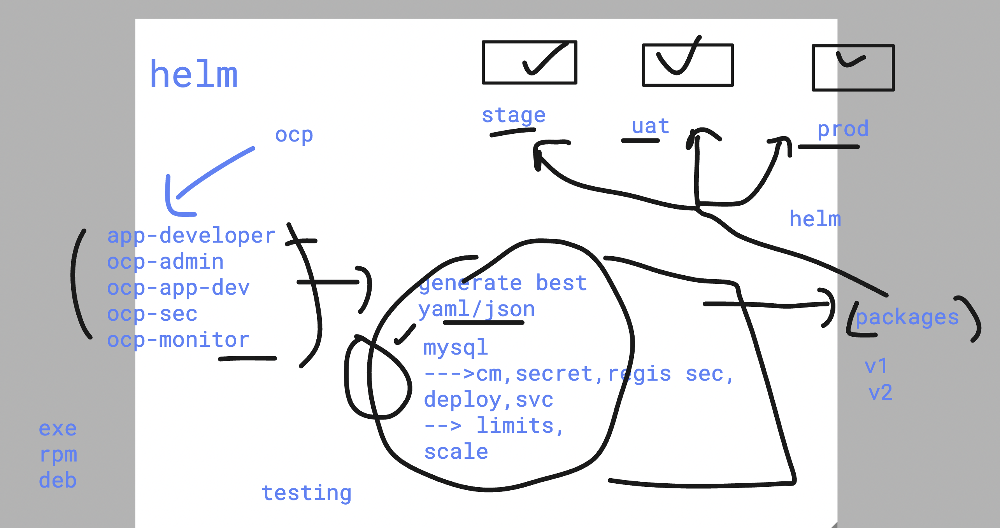
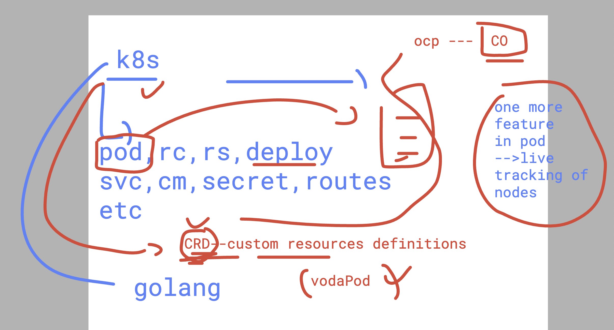
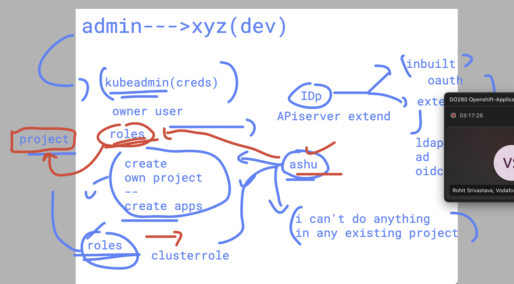

# DO-280-vodafone-15thDec_2025

### some important oc commands 

```
 oc whoami
kube:admin
[ec2-user@openshift ~]$ oc whoami --show-console 

https://console-openshift-console.apps.mayank.openshiftlab.xyz
[ec2-user@openshift ~]$ 
[ec2-user@openshift ~]$ 
[ec2-user@openshift ~]$ 

[ec2-user@openshift ~]$ oc whoami --show-server
https://api.mayank.openshiftlab.xyz:6443


```

### basic podman commands

```
c2-user@openshift ~]$ podman ps
CONTAINER ID  IMAGE       COMMAND     CREATED     STATUS      PORTS       NAMES
[ec2-user@openshift ~]$ podman ps -a
CONTAINER ID  IMAGE       COMMAND     CREATED     STATUS      PORTS       NAMES
[ec2-user@openshift ~]$ podman pull alpine 
Resolved "alpine" as an alias (/etc/containers/registries.conf.d/000-shortnames.conf)
Trying to pull docker.io/library/alpine:latest...
Getting image source signatures
Copying blob 1074353eec0d done   | 
Copying config e7b39c54cd done   | 
Writing manifest to image destination
e7b39c54cdeca0d2aae83114bb605753a5f5bc511fe8be7590e38f6d9f915dad
[ec2-user@openshift ~]$ podman run -itd --name x1  alpine sleep 10000 
0bc7ee479b7f0f32ad1edd25fd13bd29b131acbd51f16ee3477b70029957079d
[ec2-user@openshift ~]$ podman ps 
CONTAINER ID  IMAGE                            COMMAND      CREATED        STATUS        PORTS       NAMES
0bc7ee479b7f  docker.io/library/alpine:latest  sleep 10000  3 seconds ago  Up 3 seconds              x1
[ec2-user@openshift ~]$ 

```

## Understanding Helm 



### using events 

```
 oc get events 
LAST SEEN   TYPE     REASON                   OBJECT                           MESSAGE
2m37s       Normal   Scheduled                pod/ashu-db-7bf96f445-jghs4      Successfully assigned ashu-project/ashu-db-7bf96f445-jghs4 to ip-10-0-55-78.ec2.internal
2m34s       Normal   SuccessfulAttachVolume   pod/ashu-db-7bf96f445-jghs4      AttachVolume.Attach succeeded for volume "pvc-aa9e7a81-c3c8-4d8d-aa9a-cfcf9153bc19"
2m29s       Normal   AddedInterface           pod/ashu-db-7bf96f445-jghs4      Add eth0 [10.131.0.19/23] from ovn-kubernetes
2m29s       Normal   Pulled                   pod/ashu-db-7bf96f445-jghs4      Container image "vodaserver.azurecr.io/mysql:v1" already present on machine
2m28s       Normal   Created                  pod/ashu-db-7bf96f445-jghs4      Created container mysql
2m28s       Normal   Started                  pod/ashu-db-7bf96f445-jghs4      Started container mysql

```

### CRD in k8s / ocp 



### checking cluster health with /healthz url 

#### Note ocp cluster operator are the reason 

```
[ec2-user@openshift ~]$ oc get --raw  /healthz 
ok[ec2-user@openshift ~]$ 
[ec2-user@openshift ~]$ 
[ec2-user@openshift ~]$ oc get  co 
NAME                                       VERSION   AVAILABLE   PROGRESSING   DEGRADED   SINCE   MESSAGE
authentication                             4.16.0    True        False         False      2d1h    
baremetal                                  4.16.0    True        False         False      3d3h    
cloud-controller-manager                   4.16.0    True        False         False      3d3h    
cloud-credential                           4.16.0    True        False         False      3d3h    
cluster-autoscaler                         4.16.0    True        False         False      3d3h    

```

### few more commands 

```
677  oc get --raw  / 
  678  oc get --raw  /healthz 
  679  oc get  co 
  680  oc get  co  etcd  
  681  oc describe   co  etcd  
  682  oc projects  | grep -i apiserver
  683  oc get po -n openshift-kube-apiserver
```

### understanding user and permission in OCP 



### checking roles and clusterroles 

```
687  oc get roles 
  688* oc project 
  689  oc get roles -A
  690  oc get clusterroles 
```

### testing with user dev

```
oc whoami --show-server
https://api.mayank.openshiftlab.xyz:6443
[ec2-user@openshift ~]$ oc whoami --show-console
https://console-openshift-console.apps.mayank.openshiftlab.xyz
[ec2-user@openshift ~]$ sudo -i
[root@openshift ~]# 
[root@openshift ~]# 
[root@openshift ~]# oc login https://api.mayank.openshiftlab.xyz:6443  -u dev1 
WARNING: Using insecure TLS client config. Setting this option is not supported!

Console URL: https://api.mayank.openshiftlab.xyz:6443/console
Authentication required for https://api.mayank.openshiftlab.xyz:6443 (openshift)
Username: dev1
Password: 
Login successful.

You don't have any projects. You can try to create a new project, by running

    oc new-project <projectname>

[root@openshift ~]# oc project
No project has been set. Pass a project name to make that the default.
[root@openshift ~]# 
[root@openshift ~]# oc get nodes
Error from server (Forbidden): nodes is forbidden: User "dev1" cannot list resource "nodes" in API group "" at the cluster scope
[root@openshift ~]# 
[root@openshift ~]# 
[root@openshift ~]# oc version 
Client Version: 4.16.0
Kustomize Version: v5.0.4-0.20230601165947-6ce0bf390ce3
Kubernetes Version: v1.29.5+29c95f3
[root@openshift ~]# oc get nodes
Error from server (Forbidden): nodes is forbidden: User "dev1" cannot list resource "nodes" in API group "" at the cluster scope
[root@openshift ~]# oc get pod
Error from server (Forbidden): pods is forbidden: User "dev1" cannot list resource "pods" in API group "" in the namespace "default"
[root@openshift ~]# oc project default 
error: You are not a member of project "default".
You have one project on this server: dev
[root@openshift ~]# 

```
### creating a brand new project 

```
oc whoami
dev1
[root@openshift ~]# oc project 
No project has been set. Pass a project name to make that the default.
[root@openshift ~]# 
[root@openshift ~]# 
[root@openshift ~]# oc new-project ashu-final-day
Now using project "ashu-final-day" on server "https://api.mayank.openshiftlab.xyz:6443".

You can add applications to this project with the 'new-app' command. For example, try:

    oc new-app rails-postgresql-example

to build a new example application in Ruby. Or use kubectl to deploy a simple Kubernetes application:

    kubectl create deployment hello-node --image=registry.k8s.io/e2e-test-images/agnhost:2.43 -- /agnhost serve-hostname

[root@openshift ~]# oc project
Using project "ashu-final-day" on server "https://api.mayank.openshiftlab.xyz:6443".
[root@openshift ~]# 

```

### creating deployment using private image 

```
### secret creation 

oc create  secret    docker-registry ashu-img-secret  --docker-server vodaserver.azurecr.io --docker-username vodaserver  --docker-password "xsdfsdf1" --dry-run=client -o yaml >registry_cred.yaml
 
oc create -f registry_cred.yaml 
### deployment creation 

oc create deployment ashud5 --image vodaserver.azurecr.io/nginx:v1 --dry-run=client -o yaml >deploy1.yaml 

```

### updated yaml

```
oc create -f deploy1.yaml 
deployment.apps/ashud5 created
[ec2-user@openshift final-day-yamls]$ oc get deploy
NAME     READY   UP-TO-DATE   AVAILABLE   AGE
ashud5   0/1     1            0           4s
[ec2-user@openshift final-day-yamls]$ 


```

### allow default sa to use anyuid as scc in ashu-final-day project

```
oc adm policy add-scc-to-user   anyuid -z default -n  ashu-final-day

```

### HPA with metric server

```
oc get pod -n openshift-monitoring
NAME                                                     READY   STATUS    RESTARTS   AGE
alertmanager-main-0                                      6/6     Running   18         3d6h
alertmanager-main-1                                      6/6     Running   18         3d6h
cluster-monitoring-operator-6b94d5d5-vrtrx               1/1     Running   3          3d6h
kube-state-metrics-c9f6d488-s5hwt                        3/3     Running   9          3d6h
metrics-server-66d6bc7cfc-b9hrw                          1/1     Running   2          2d7h
metrics-server-66d6bc7cfc-jsrq2                          1/1     Running   2          2d7h
monitoring-plugin-8567bcb698-lbbxh                       1/1     Running   3          3d6h
monitoring-plugin-8567bcb698-sr9b6                       1/1     Running   3          3d6h
node-exporter-2xpcs                                      2/2     Running   6          3d6h

```

### doing hpa with deployment 

```
 oc autoscale deployment ashud5 --cpu-percent=70  --max=20 --min=2 --dry-run=client -o yaml >hpa.yaml 
[ec2-user@openshift final-day-yamls]$ ls
deploy1.yaml  hpa.yaml  registry_cred.yaml
[ec2-user@openshift final-day-yamls]$ oc get po
NAME                      READY   STATUS    RESTARTS   AGE
ashud5-854495c456-4psvc   1/1     Running   0          36m
[ec2-user@openshift final-day-yamls]$ oc create -f hpa.yaml 
horizontalpodautoscaler.autoscaling/ashud5 created
[ec2-user@openshift final-day-yamls]$ 
[ec2-user@openshift final-day-yamls]$ 
[ec2-user@openshift final-day-yamls]$ oc get hpa
NAME     REFERENCE           TARGETS         MINPODS   MAXPODS   REPLICAS   AGE
ashud5   Deployment/ashud5   <unknown>/70%   2         20        0          3s
[ec2-user@openshift final-day-yamls]$ oc get  po
NAME                      READY   STATUS    RESTARTS   AGE
ashud5-854495c456-4psvc   1/1     Running   0          36m

```

### jobs in ocp 

```
oc create -f job1.yaml 
job.batch/ashu-job created
[ec2-user@openshift final-day-yamls]$ oc get job
NAME       COMPLETIONS   DURATION   AGE
ashu-job   0/1           4s         4s
[ec2-user@openshift final-day-yamls]$ oc get job
NAME       COMPLETIONS   DURATION   AGE
ashu-job   1/1           9s         9s
[ec2-user@openshift final-day-yamls]$ oc get pod
NAME             READY   STATUS      RESTARTS   AGE
ashu-job-fqvgm   0/1     Completed   0          13s
[ec2-user@openshift final-day-yamls]$ oc logs ashu-job-fqvgm 
Hello OpenShift
[ec2-user@openshift final-day-yamls]$ oc logs job/ashu-job
Hello OpenShift

```

